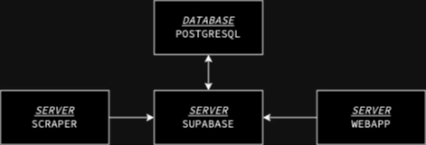
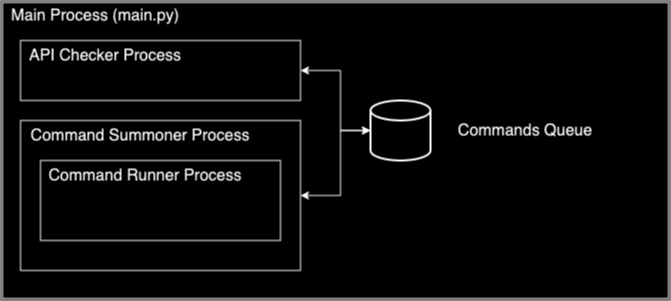
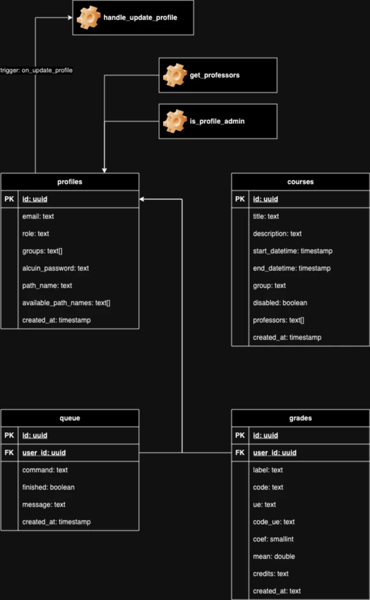

# Alcuin Open Interface Documentation

Ce projet est une interface pour la plateforme https://esaip.alcuin.com. Il permet la mise en place d’APIs d’accès à
certaines données présentes sur le site : les cours et les notes.

## Le problème

Arrivés en 2021 à l’ESAIP, nous avons constaté que les différentes plateformes d’accès aux données de l’école mises en
places était compliqués à prendre en main et peu confortable à utiliser. La première idée qui nous est venue a été le
transfert des cours dans les calendriers natifs des smartphones et ordinateurs (Apple Calendars, Samsung Calendar,
Google Calendars…). Nous nous sommes ensuite rendus compte que certains élèves ne notaient pas ou s’organisaient mal
quant aux devoirs et aux évaluations à venir. Enfin, l’accès aux notes est fastidieux.

## Le fonctionnement de l’application

Le service Alcuin n’ayant pas d’API (publique). La récupération des informations nécessaires ; nous avons été dans
l’obligation de mettre en place des scrapers afin d’aller récupérer les données en simulation la connexion grâce à un
navigateur. D’une autre part, une application web permet la gestion et l’affichage de ces informations.

## Les contraintes

Ce projet est soumis à quelques contraintes. Premièrement, le serveur sur lequel est hébergé le(s) scraper(s) est une
machine située sur un réseau local lequel est connecté au réseau par le biais d’une box 5 g. De ce fait, l’adresse IP de
ce réseau ne sera jamais fixe et aucune requête entrante ne pourra être effectuée avec stabilité.
Le projet étant un projet étudiant, le(s) langage(s) utilisé(s) doi(t/vent) être de haut niveau afin de permettre une
maintenance plus aisée.

# Stack

Selon les contraintes énoncées précédemment, le langage choisi pour le développement du scraper est le Python. En
parallèle, cette partie du projet (le scraper) sera encapsulé dans un conteneur Docker. Le serveur (étant sous Linux) et
les développeurs pouvant être sûr des systèmes d’exploitations différents, cela permettra d’éviter des bugs de
compatibilité. D’une autre part, Supabase sera utilisé pour l’encapsulation de la base de donnée. Les fonctionnalités
telles que le kit de développement, les fonctions et triggers Postgres correspondent aux besoins du projet et s’adaptent
à
plusieurs langages au besoin. Enfin, pour l’application web, NextJS sera utilisé sous Typescript. Solution en vogue et
populaire en 2023, une grande quantité d’informations et de documentation est disponible. De plus React permet une
grande flexibilité dans le dynamisme des composants créés.

# Architecture

L’application est divisée en trois parties distinctes du point de vue de l’expérience développeur et trois ou quatre en
termes de serveurs.

Premièrement, le serveur responsable de l’hébergement du scraper est sous Ubuntu (non nécessaire) et le « service » est
exécuté au travers d’un conteneur Docker. Pour ce qui est de la base de donnée, l’hébergement sera géré par Supabse.
Enfin pour l’application web, le nom de domaine est géré par Ionos et l’hébergement est géré par Vercel.

# Le scraper

Cette partie de l’application est développée en python et exécutée dans un conteneur Docker.

Le scraper est la partie de l’application responsable de la récupération et du téléchargement (vers la bdd) des données.
Les données en question étant les « calendriers » soit les cours et les notes des élèves.

## Fonctionnement Haut Niveau

Le fonctionnement du scraper se découpe en deux parties, celle-ci correspond au niveau de gestion haut niveau,
c’est-à-dire la gestion de la queue et des commandes.

Le scraper est divisé en plusieurs commandes, une commande étant une exécution d’un navigateur avec un « tuyaux » (que
l’on appellera Pipe), notion sur laquelle nous reviendrons dans la partie (Fonctionnement Bas Niveau). Chaque commande
étant responsable de la simulation d’un navigateur (prenant une quantité relativement importante des performances), nous
avons décidé de n’exécuter qu’une commande à la fois. C’est la raison de l’implémentation d’une queue, permettant
l’exécution à la chaîne des commandes lorsque l’exécution de plusieurs commandes a été requises dans un interval de
temps où toutes ne peuvent l’être.

Comme expliqué dans la partie Les Contraintes, aucune requête ne peut être faite au scraper. C’est pour cette raison que
la queue (de commandes) est matérialisée par la table queue dans la base de donnée.

Le scraper utilise le multiprocessing afin de gérer parallèlement ces deux tâches. Une queue locale est implémentée et
réplique la queue de la base de donnée (à quelques différences près), cette queue est partagée entre les deux processus.
Le premier processus, responsable de la mise à jour de la queue local fait des requêtes toutes les X secondes à la base
de donnée et compare la queue (en ligne) avec la queue locale et les mets à jour si besoin.
Le second processus, lui, est responsable de l’exécution de la queue, il exécute donc 1 à 1 les commandes présentes dans
la queue. À noter que lors de l’exécution d’une commande, un troisième processus et créé, il est cependant détruit dès
la fin de l’exécution de la commande.

## Fonctionnement Bas Niveau

La seconde partie du scraper est responsable de l’exécution des opérations relatives à la gestion des données et la
simulation du navigateur.

Ces opérations sont indépendantes et exécutées par le biais d’une Pipe (design pattern) ou les opérations sont exécutés
à
la chaîne en se passant les données d’une opération à une autre. L’utilisation de ce design pattern permet une
modularité et une indépendance facilitant le débogage et le test. Trois commandes existent actuellement (lun. 20
Nov.) :

- SCRAPE_CALENDARS : Qui exécute une pipe qui récupère les données de tous les calendriers des promotions / spécialités
- SCRAPE_GRADES : Qui exécute une pipe qui récupère les notes de l’élève dont l’identifiant est spécifié dans la queue
- SCRAPE_PATH_NAMES : Qui exécute une pipe qui récupère les parcours disponibles de l’élève dont l’identifiant est
  spécifié dans la queue

Plusieurs opérations ont été créés pour répondre aux besoins des différentes pipes, notamment :

- Des opérations de “scrape” qui consistent à exécuter une instance d’un navigateur et de récupérer le(s) contenu(s)
  HTML d’une/de certains portion(s) d’une/de certains certaine(s) page(s).
- Des opérations de “parse” qui consistent à, à partir de contenu HTML, chercher dans l’arbre de nœud les données qui
  nous intéressent et à retourner les données formatées sous forme de tableaux et/ou de dictionnaires
- Une opération “copie” qui permet la sauvegarde intelligente de certaines données (actuellement depuis la base de
  données)
- Des opérations d’”upload” qui consistent à télécharger dans la base de donnée les informations recueillie par les
  opérations de “parse”

# La base de donnée

Supabase permet l’hébergement d’une base de données Postgres et l’implémentation d’une API permettant d’accéder à ces
données par le biais de kit de développement.

Détaillons le diagramme représentant la base de données. Premièrement, il existe quatre tables dans la base de donnée
publique (Supabase administre en arrière-plan plusieurs autres bases de données, notamment pour la gestion de
l’authentification ou des logs).

- profiles : Cette table contient une réplication des utilisateurs créés par la gestion d’authentification de Supabase
  par le biais de trois fonctions et trois trigger (handle_new_user, handle_update_user, handle_old_user). La colonne
  “groups” à la liste des groupes dont l’utilisateur peut modifier les informations sur le calendrier. Les colonnes
  “alcuin_password”, “path_name” et “available_path_names” servent au “scraper” pour les notes.
- courses : Cette table contient l’ensemble des cours des élèves.
- queue : Contrairement aux autres tables, le nom de celle-ci n’est pas le nom des éléments au pluriel. Cette table est
  la queue utilisée pour l’exécution des commandes du scraper. Chaque ligne dans la table correspond à une commande.
- grade : Cette table permet de stocker les notes des élèves.

D’une autre part, trois functions ont été mises en places. Deux sont pour faciliter la récupération de données (
get_professors & is_profile_admin) et une autre est exécutée par un trigger.

- get_professors : Retourne la liste des professeurs de la table “courses”
- is_profile_admin: Prends en paramètre un uuid. Retourne vrai si l’utilisateur à le role ADMIN.
- handle_update_user: Ne retourne la ligne. Ajoute à la queue les requêtes adéquates lorsque certaines propriétés du
  profil sont mises à jour.

# Installation

Afin d'installer et d'exécuter le scrapper, plusieurs méthodes sont disponibles. La méthode conseillée est d'utiliser
Docker dans le but d'exécuter le script dans un conteneur. Pour celà, il suffit d'exécuter la
commande `docker build ctrlplusw/open-alcuin-interface`. Vous obtenez ensuite une image du conteneur à exécuter. Si vous
n'utilisez pas cette méthode, vous pouvez installer les librairies requises avec la
commande `python3 -m pip install -r requirements.txt`.

Il est également nécessaire de configurer les variables d'environnement du fichier `.env` (dont vous avez un exemple
dans le fichier `.env.example`) :

- `ALCUIN_USERNAME` : Le nom d'utilisateur du compte Alcuin permettant de récupérer les calendriers
- `ALCUIN_PASSWORD` : Le mot de passe (non encrypté) du compte Alcuin permettant de récupérer les calendriers
- `SUPABASE_URL` : L'URL du serveur Supabase (peut être trouvé dans l'onglet "Paramètres du Projet" dans la catégorie "
  API")
- `SERVICE_ROLE_KEY` : La clé du rôle de service Supabase (peut être trouvé dans l'onglet "Paramètres du Projet" dans la
  catégorie "API")
- `RSA_PRIVATE_KEY` : La clée privée pour l'encryptage des mots de passes Alcuin des utilisateurs

# Exécution

Pour exécuter le project sous docker, vous pouvez exécuter la commande
suivante : `docker run --detach ctrlplus/open-alcuin-interface` (après avoir généré l'image). Sinon, vous pouvez
exécuter un des fichiers mains en tant que module avec la commande suivante : `python3 -m src.main`.

À noter que si vous spécifiez le drapeau `--dev` lors de l'exécution du script, celui-ci s'exécutera avec Firefox et non
en mode Headless.

Le fichier `main.py` permet d'exécuter le service global du scraper. Si vous souhaitez exécuter seulement une fois la
pipe de scrape des calendriers, vous pouvez exécuter le fichier `main__scrape_calendars.py`. Enfin, le
fichier `main__scrape_grades.py` permet d'exécuter une fois la pipe de récupération des notes d'un utilisateur dont
l'email sera spécifié en paramètre d'appel du script.